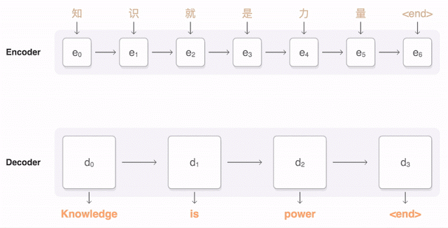
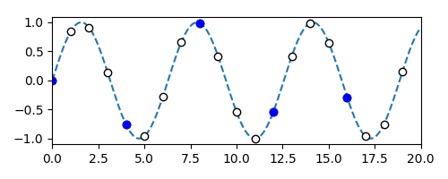
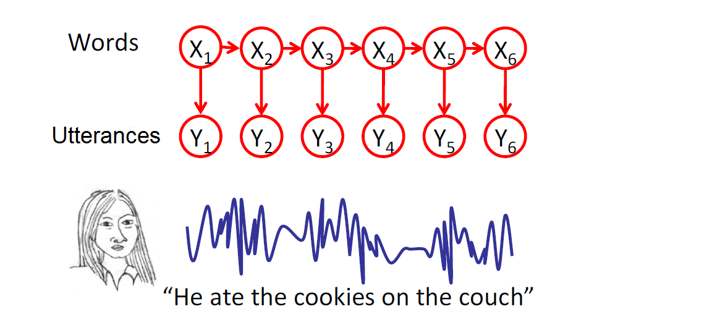
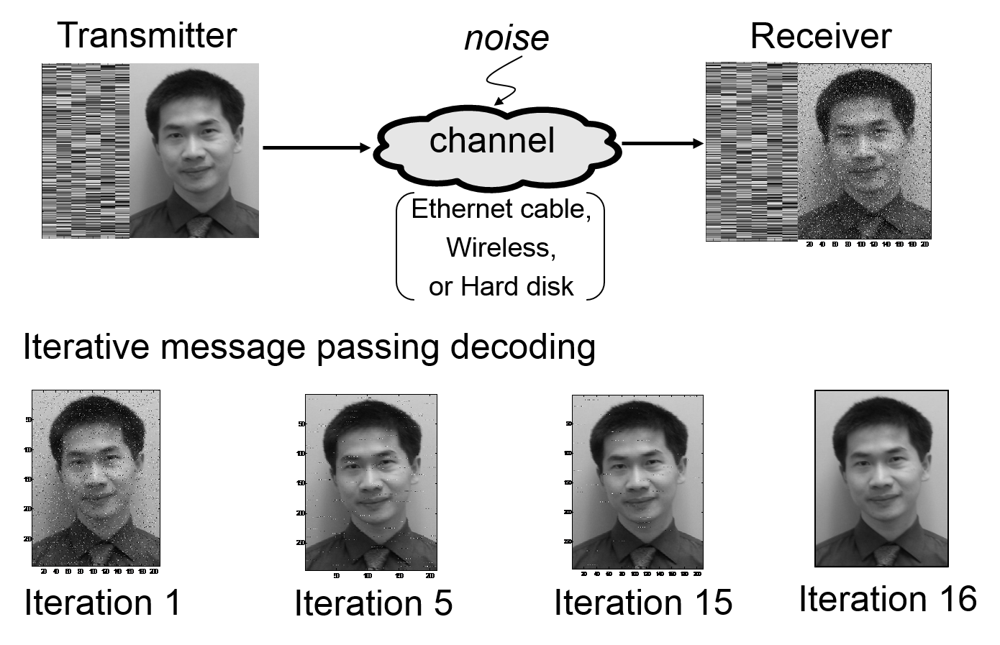
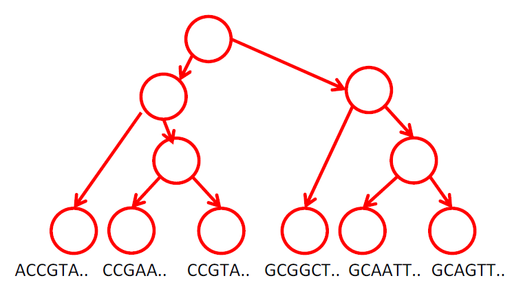
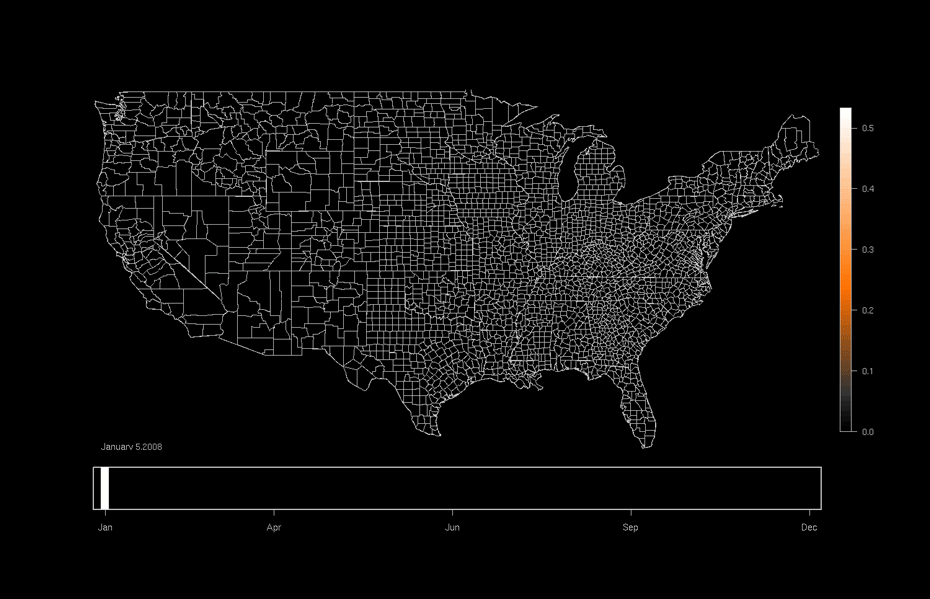

Probabilistic graphical models have numerous and diverse real-world applications.  We provide an overview of the following applications of probablistic graphical models, which are just a few examples of their many practical uses.

  + **Images**
    - [Generation](#image-generation)
    - [In-Painting](#image-inpainting)
    - [Denoising](#image-denoising)
  + **Language**
    - [Generation](#text-generation)
    - [Translation](#text-translation)
  + **Audio**
    - [Super-Resolution](#audio-superresolution)
    - [Speech Synthesis](#speech-synthesis)
    - [Speech Recognition](#speech-recognition)
  + **Science**
    - [Error-Correcting Codes](#error-correcting-codes)
    - [Computational Biology](#comp-bio)
    - [Ecology](#ecology)
    - [Economics](#economics)
  + **Health Care and Medicine**
    - [Diagnosis](#diagnosis)
    
## Probabilistic Models of Images

Consider a distribution $$p(\mathbf{x})$$ over images, where $$\mathbf{x}$$ is an image represented as a vector of pixels, that assigns high probability to images that look realistic and low probability to everything else. Given such a model, we can solve a wide array of interesting tasks.

### Image Generation

[Radford et al.](https://arxiv.org/abs/1710.10196) trained a probabilistic model $$ p(\mathbf{x}) $$ that assigns high probability to images that look like bedrooms.  To do so, they trained their model on a dataset of bedroom images, a sample of which is shown below:

**Training Data**  
  

Now that we have this probablistic model of bedrooms, we can now _**generate**_ new realistic bedroom images by sampling from this distribution.  Specifically, new sampled images $$\hat{\mathbf{x}} \sim p(\mathbf{x})$$ are created directly from our model $$p(\mathbf{x})$$, which can now generate data similar to the bedroom images that we trained it with.  

Moreover, one of the reasons why generative models are powerful lie in the fact that they have many fewer parameters than the amount of data that they are trained with --- as a result, the models have to efficiently distill the essence of the training data to be able to generate new samples.  We see that our particular probablistic model of bedrooms has done a good job of capturing the data's essence, and can therefore produce highly realistic images, some examples of which are shown below:

**Generated Data**  

Similiarly, we can learn a model for faces.  

As with the bedroom images, these faces are completely synthetic --- these images are not of an actual person.  

The same approach can be used for other objects.

 

Note that the images are not perfect and may need to be refined; however, sampling generates images that are very similiar to what one might expect. 

### In-Painting

Using the same $$p(\mathbf{x})$$ for faces as before, we can also "fill in" the rest of an image. For example, given $$p(\mathbf{x})$$ and a patch of an existing image (e.g., a piece of a photograph), we can sample from $$p(\textsf{image} \mid \textsf{patch})$$ and generate different possible ways of completing the image:

Note the importance of a probabilistic model that captures uncertainty: there could be multiple ways to complete the image!

### Image Denoising

Similarly, given an image corrupted by noise (e.g., an old photograph), we can attempt to restore it based on our probabilistic model of what images look like.  Specifically, we want to generate a graphical model that does a good job at modeling the posterior distribution $$p(\textsf{original image} \mid \textsf{noisy image}).$$  Then, by observing the noisy image, we can sample or use exact inference to predict the original image.

## Language Models

Knowing the probability distribution can also help us model natural langauge utterances. In this case, we want to construct a probability distribution $$p(x)$$ over sequences of words or characters $$x$$ that assigns high probability to proper (English) sentences.  This distribution can be learned from a variety of sources, such as Wikipedia articles.

### Generation

Let's say that we have constructed a distribution of word sequences from Wikipedia articles.  We can then sample from this distribution to generate new Wikipedia-like articles like the one below.

> Naturalism and decision for the majority of Arab countries' capitalide was grounded
by the Irish language by [[John Clair]], [[An Imperial Japanese Revolt]], associated 
with Guangzham's sovereignty. His generals were the powerful ruler of the Portugal 
in the [[Protestant Immineners]], which could be said to be directly in Cantonese 
Communication, which followed a ceremony and set inspired prison, training. The 
emperor travelled back to [[Antioch, Perth, October 25|21]] to note, the Kingdom 
of Costa Rica, unsuccessful fashioned the [[Thrales]], [[Cynth's Dajoard]], known 
in western [[Scotland]], near Italy to the conquest of India with the conflict. 
Copyright was the succession of independence in the slop of Syrian influence that 
was a famous German movement based on a more popular servicious, non-doctrinal 
and sexual power post. Many governments recognize the military housing of the 
[[Civil Liberalization and Infantry Resolution 265 National Party in Hungary]], 
that is sympathetic to be to the [[Punjab Resolution]]
(PJS)[http://www.humah.yahoo.com/guardian.
cfm/7754800786d17551963s89.htm Official economics Adjoint for the Nazism, Montgomery 
was swear to advance to the resources for those Socialism's rule, 
was starting to signing a major tripad of aid exile.]]

### Translation

Suppose that we have gathered a training set of paragraphs that were transcribed in both English and Chinese. We can build a probabilistic model $$p(y \mid x)$$ to generate an English sentence $$y$$ conditioned on the corresponding Chinese sentence $$x$$; this is an instance of *machine translation*.

## Audio Models 

We can also use probabilitic graphical models for audio applications. Suppose we construct a probability distribution $$p(x)$$ over audio signals that assigns high probability to ones that sound like human speech.

### Upsampling or Super-Resolution

Given a low resolution version of an audio signal, we can attempt to increase its resolution.  We can formulate this problem as follows: given our speech probability distribution $$p(x)$$ that "knows" what typical human speech sounds like and some observed values of an audio signal, we aim to calculate signal values at intermediate time points.

In the diagram below, given observed audio signals (blue) and some underlying model of the audio, we aim to reconstruct a higher-fidelity version of the original signal (dotted line) by predicting intermediate signals (white).

We can solve this by sampling or performing inference on $$p(\textbf{I} \mid \textbf{O})$$, where $$\textbf{I}$$ are the intermediate signals that we want to predict, and $$\textbf{O}$$ are the observed low-resolution audio signals.

[Super resolution of audio signals demo](https://kuleshov.github.io/audio-super-res/)

### Speech synthesis

As we did in image processing, we can also sample the model and generate (synthesize) speech signals.

[Super resolution of audio signals demo](https://deepmind.com/blog/wavenet-generative-model-raw-audio/)

### Speech recognition
Given a (joint) model of speech signals and language (text), we can attempt to infer spoken words from audio signals.

## Applications in Science Today

### Error Correcting Codes
In the non-theoretical world, probabilistic models are often used to model communication channels (e.g., Ethernet or Wifi). I.e., if you send a message over a channel, you might get something different on the other end due to noise. Error correcting codes and techniques based on graphical models are used to detect and correct communication errors.

### Computational Biology

Graphical models are also widely used in computational biology. For example, given a model of how DNA sequences evolve over time, it is possible to reconstruct a phylogenetic tree from DNA sequences of a given set of species.

### Ecology
Graphical models are used to study phenomena that evolve over space and time, capturing spatial and temporal dependencies. For example, they can be used to study bird migrations.

### Economics

Graphical models can be used to model spatial distributions of quantities of interests (e.g., assets or expenditures based measures of wealth).

The last two applications are what are known as spatio-temporal models. They depend on data that is collected across time as well as space.

## Applications in Health Care and Medicine

### Medical Diagnosis

Probabilistic graphical models can assist doctors in diagnosing diseases and predicting adverse outcomes. For example, in 1998 the LDS Hospital in Salt Lake City, Utah developed a Bayesian network for diagnosing pneumonia. Their model was able to distinguish patients with pneumonia from patients with other diseases with high sensitivity (0.95) and specificity (0.965), and was used for many years in the clinic. Their network model is outlined below:

You can read more about the development of their model <a href="https://www.ncbi.nlm.nih.gov/pmc/articles/PMC2232064/">here.</a>
 

|[Index](../../) | [Previous](../probabilityreview/) |  [Next](../../representation/directed/)|
